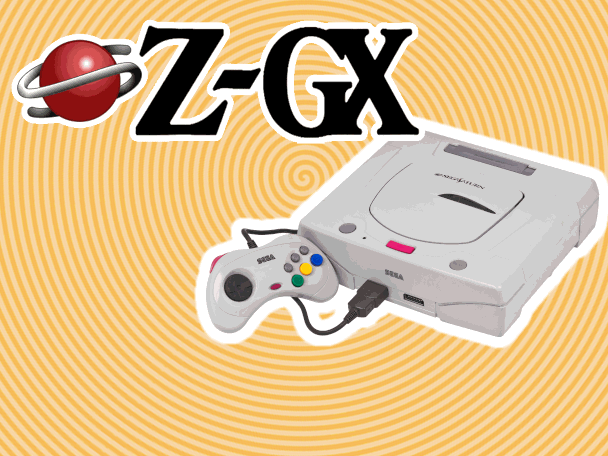
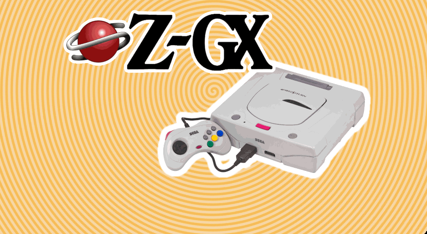

# Z-GX Forwarder Channel

A Wii channel that boots straight into [**Z-GX**](https://github.com/hotker79/Z-GX), an experimental Sega Saturn emulator.

## Screenshots

<table>
  <thead>
    <tr>
      <th width="50%">4:3 Icon</th>
      <th width="50%">4:3 Banner</th>
    </tr>
  </thead>
  <tbody>
    <tr>
      <td></td>
      <td></td>
    </tr>
  </tbody>
</table>

<table>
  <thead>
    <tr>
      <th width="50%">16:9 Icon</th>
      <th width="50%">16:9 Banner</th>
    </tr>
  </thead>
  <tbody>
    <tr>
      <td></td>
      <td></td>
    </tr>
  </tbody>
</table>

## Requirements

- **IOS58** — update to System Menu 4.3, or use the [IOS58 Installer](https://wiibrew.org/wiki/IOS58_Installer).
- **Z-GX installed to `apps/ZGX/boot.dol`** on SD or USB — that exact folder name. This channel is a forwarder, not a self-contained emulator.
- **A Sega Saturn BIOS image**, at `sd:/ZGX/bios/bios.bin`. Not included, and required.

| Title ID | Region | NAND Blocks |
|---|---|---|
| ZGXA (000100015A475841) | Free | 11 |

## Read this first: Z-GX is experimental

**Upstream ships no prebuilt binary**, so there is no release to download — `apps/ZGX/boot.dol` has to be built from source. [BUILDING.md](BUILDING.md#building-z-gx-itself) documents that build, including four non-obvious dependency gotchas that cost time to work out.

The emulator is also, by its author's own description, an experimental project that is not polished for stability — the repository carries a `BUG_VIDEO_BITMAP.md` describing unresolved black-screen problems.

The forwarder is not specific to any build of Z-GX. When the author publishes a working binary, drop it in as `apps/ZGX/boot.dol` and the channel will launch it — nothing here needs rebuilding.

## Install

> **Install BootMii and/or Priiloader first.** I took time to make sure that this `.wad` is safe — the icon sits at 38% of the System Menu's hard size cap and the banner at 34% of FCE Ultra GX's banner memory, and every check in `build/tools/verify.py` passes — but one should always have protections in place in case of a banner brick.

1. Build Z-GX and copy it to `sd:/apps/ZGX/boot.dol`. `build/build.sh` stages a ready-to-copy SD tree at `build/out/sdcard/`, including a `meta.xml` and icon so it also appears in the Homebrew Channel.
2. Put your Saturn BIOS at `sd:/ZGX/bios/bios.bin`, and games in `sd:/ZGX/games/` as `.chd` or `.cue`.
3. Install `Z-GX - ZGXA [cmyksoda].wad` with the WAD manager of your choice.

The channel looks for `boot.dol` in `apps/ZGX/` on SD or USB, scanning both.

## Uninstall

Use the WAD manager you installed with, or delete the channel from the Wii system settings. Nothing outside the channel's own NAND title is touched.

## Troubleshooting

**Black screen, or nothing happens after the splash.** Almost certainly Z-GX itself rather than the channel — see the warning above. The author's notes say the Saturn BIOS takes around 10 seconds to load, so several seconds of blank screen is expected and not yet a failure. Check that `sd:/apps/ZGX/boot.dol` exists, spelled exactly that way, and that the BIOS is at `sd:/ZGX/bios/bios.bin`.

## Credits

### Emulator forwarded to

- [**Z-GX**](https://github.com/hotker79/Z-GX) by **CheloRetro** — a fork of **Seta GX** by **Evoca (fadedled)**, itself a heavily modified port of **Yabause**, with SCU emulation and CHD support from **devmiyax**'s **Yaba Sanshiro**. Video acceleration uses the Hollywood GPU.
- The Z-GX logo is the author's work.

### Channel base

**FCE Ultra GX Channel** — donor for the banner archive, the NAND loader stub and the forwarder.

- **wilsoff**: coding
- **MrNick666**: artwork
- **Tantric**: forwarder and installer
- **svpe** and **megazig**: installer exploit

The banner and icon layouts are Tantric's, edited rather than rebuilt — every section the System Menu expects is still where it was. The banner logo's squash-and-stretch landing is his animation too, lifted verbatim from the Snes9x GX / FCE Ultra GX banner and only mirrored so the logo arrives from the left. The forwarder is his DOL with three in-place data patches (two splash PNGs and the app path); `verify.py` asserts the entire `.text` section is byte-identical to the original. All of it is documented in [BUILDING.md](BUILDING.md).

### Graphics and sound

- The banner and icon composites are my own work. The spiral background is generated rather than drawn — `build/tools/spiral.py` fits an Archimedean spiral to my reference art to a mean error of 0.20/255, so it can be re-rendered at any size without distorting the rings.
- Sega Saturn, the Saturn console, its startup sound, and its controller are the intellectual property of **Sega**.

### Tools used

- **Benzin 2.1.12BETA** by **SquidMan (Alex Marshall)**, **comex** and **megazig**, © 2009 HACKERCHANNEL — `brlyt`/`brlan` XML round-trips, which are byte-exact
- **ImageMagick** and **ffmpeg**
- **devkitPPC** / **libogc2** — for building Z-GX itself
- Everything else is in `build/tools/`: a from-scratch Python implementation of the WAD container, U8, LZ77, IMD5/IMET, TPL and a DSP ADPCM encoder, written because `libWiiSharp` is Windows-only. All of it was validated by byte-exact round-trip against the stock FCE Ultra GX WAD before being trusted.

## License

The parts of this repository that are mine — the build toolchain in `build/`, the channel art, and the documentation — are GPLv3, see [`LICENSE`](LICENSE).

This channel is built out of other people's GPL'd work, which stays under the licenses it came with:

- the forwarder, banner archive and icon are derived from [FCE Ultra GX](https://github.com/dborth/fceugx)
- the emulator it launches, [Z-GX](https://github.com/hotker79/Z-GX), is GPLv2 and is **not** redistributed here

Nothing here relicenses any of that. Every change made to the FCE Ultra GX components is documented in [BUILDING.md](BUILDING.md) — that file is the GPL modification record as much as it is a build guide.

Sega's assets are used for a non-commercial fan project and are not covered by any of the above; they remain the property of their owners.

## Repository contents

| path | |
|---|---|
| `Z-GX - ZGXA [cmyksoda].wad` | the channel — install this |
| `banner/` | banner art, 832×456. `logo.png` and `saturnmk2.png` are the sprites the build composites; `bg.png` is the reference the spiral generator is fitted against; `banner.png` is the reference composite the sprite placements were measured from |
| `icon/` | icon art, 176×96. `icon_logo.png` is the sprite; `icon_bg.png` is the icon-scale spiral reference |
| `splash/` | source for both forwarder loading screens |
| `audio/` | source for the banner sound |
| `preview/` | the icon animation as GIFs and the banner as stills, rendered from the real keyframes |
| `build/` | `build.sh` and the Python toolchain that rebuilds everything |
| `BUILDING.md` | how to rebuild, and what was changed in the GPL'd components |
| `Icon_Sizing.md` | my notes on Wii channel art sizing for 4:3 versus 16:9 |

`banner/` and `icon/` also hold the working files the build never reads — the GIMP `.xcf`s, `icon.png`, and `Z-GX_copy.jpg` (the upstream Z-GX logo the channel art was traced from).

The icon's banner archive still carries stub textures named after Mario and a Goomba, four by four pixels and fully transparent. They are invisible, and they are there on purpose — every `txl1` entry and every `RLTP` reference in Tantric's animations has to still resolve.

---

*This project was made with AI assistance. For more information, see [my AI usage statement](https://github.com/cmyksoda/cmyksoda/blob/main/AI_USAGE.md).*
